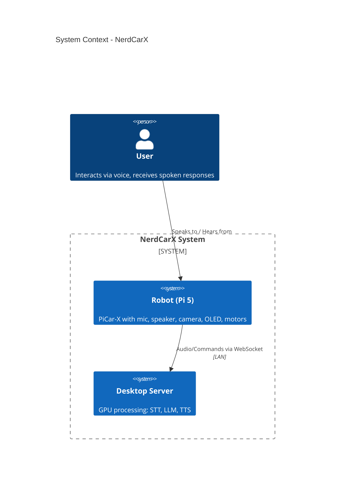
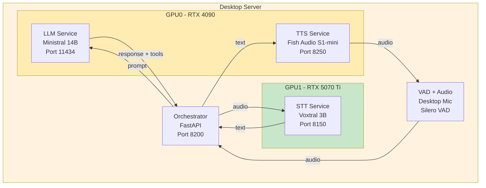
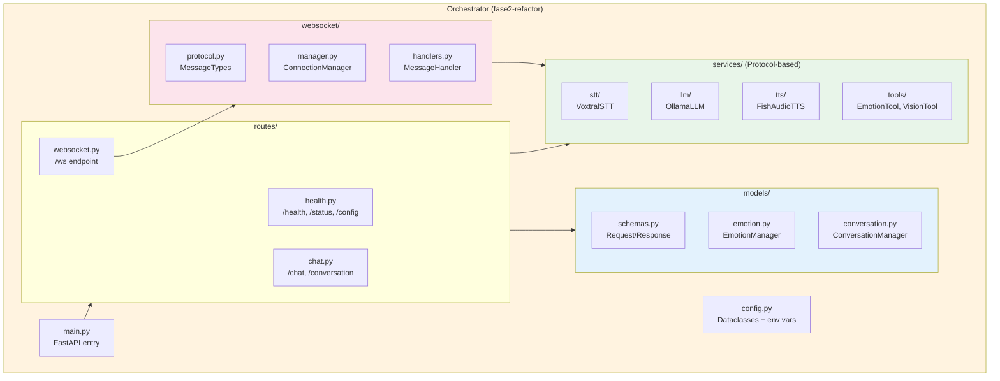
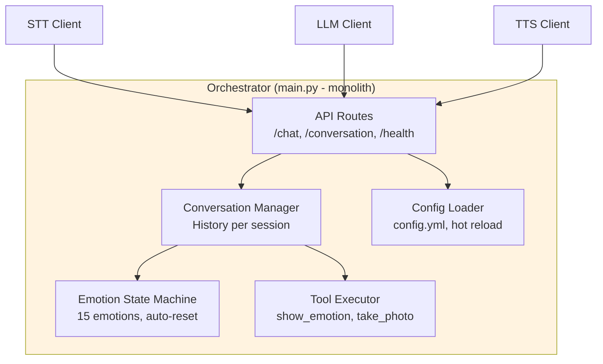
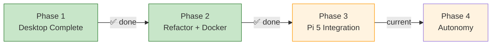

# NerdCarX - Architecture Overview

> **Last updated:** 2026-01-17
> **Current Phase:** 3 (Pi Integration) - Phase 1, 2 & 3a COMPLETED

---

## Table of Contents

1. [Executive Summary](#1-executive-summary)
2. [Design Rationale](#2-design-rationale)
3. [What Can It Do?](#3-what-can-it-do)
4. [Hardware Platform: PiCar-X](#4-hardware-platform-picar-x)
5. [System Context (C1)](#5-system-context-c1)
6. [Container View (C2)](#6-container-view-c2)
7. [Component View (C3)](#7-component-view-c3)
8. [Technology Stack](#8-technology-stack)
9. [Current Status](#9-current-status)
10. [Roadmap](#10-roadmap)
11. [Future Possibilities](#11-future-possibilities)

---

## 1. Executive Summary

NerdCarX is an AI-powered robot car that can hold conversations in Dutch, display emotions, and perceive its surroundings through a camera. It's built on a PiCar-X platform with a Raspberry Pi 5, but all heavy AI processing happens on a separate desktop server with GPUs.

**Why local-first?** Everything runs locally - no cloud APIs, no subscription costs, no privacy concerns, no rate limits. The modular architecture means any component (speech recognition, language model, text-to-speech) can be swapped without rewriting the system.

**Current capability:** The desktop demo is fully functional. You can have hands-free conversations in Dutch, the system recognizes emotional context and responds appropriately, and it can describe what it "sees" through a camera. Next: connecting the actual robot hardware.

---

## 2. Design Rationale

### Why Local-First?

| Benefit | Explanation |
|---------|-------------|
| **No recurring costs** | Cloud APIs charge per request. Local = one-time hardware investment |
| **No rate limits** | Experiment freely without API throttling |
| **Privacy** | Conversations never leave your network |
| **Low latency** | No round-trip to cloud servers |
| **Learning opportunity** | Understanding the full stack, not just API calls |
| **Full control** | Tune parameters, switch models, modify behavior |

Cloud fallback is planned (Phase 4+) for flexibility, but local-first remains the default.

### Why Desktop + Pi Split?

The AI models are too demanding for a Raspberry Pi 5, even with 16GB RAM:

| Model | Issue on Pi 5 | Verdict |
|-------|---------------|---------|
| Voxtral 3B (STT) | Requires GPU for acceptable speed; CPU inference far too slow | Incompatible |
| Ministral 14B (LLM) | Requires GPU; ~20GB VRAM needed; CPU would take minutes per response | Incompatible |
| Fish Audio (TTS) | Requires GPU for real-time synthesis | Incompatible |

**The problem isn't just RAM** - the Pi 5's CPU simply cannot run these models at usable speeds. Even if models fit in memory, inference would be orders of magnitude slower than on a GPU. These models are designed for GPU compute.

> *Note: Voxtral currently uses ~15GB VRAM due to vLLM's memory management, not model size. Could be optimized, but wasn't a priority with sufficient VRAM available.*

**Solution:** Desktop does the "thinking" (GPU-heavy AI), Pi does the "sensing and acting" (mic, speaker, motors, display). They communicate over LAN via WebSocket.

### Why These Technologies?

| Choice | Why | Alternatives Considered |
|--------|-----|-------------------------|
| **Ollama** (LLM serving) | Simple setup, one command to run models, built-in API, great for local development | llama.cpp (lower level), vLLM (overkill for single model) |
| **vLLM** (STT serving) | Required for Voxtral - it's a Mistral model needing proper vLLM support, handles batching efficiently | Ollama (doesn't support Voxtral), TGI (less mature) |
| **FastAPI** (Orchestrator) | Lightweight, async, full control, no magic. LangChain considered but adds complexity without clear benefit for this use case | LangChain (too abstract), Flask (not async) |
| **Docker** | Reproducible environments, GPU isolation, easy to deploy and version | Conda only (works but less portable) |
| **WebSocket** (Pi ↔ Desktop) | Bidirectional, low latency, persistent connection for real-time interaction | REST (higher latency, polling needed), MQTT (overkill for point-to-point) |

### Why These Models?

| Model | Why This One | Key Deciding Factors |
|-------|--------------|---------------------|
| **Voxtral Mini 3B** | Dutch is one of only 8 officially supported languages. Better noise robustness than Whisper. Can do audio Q&A, not just transcription. | Tested Faster-Whisper - less robust in noisy environments |
| **Ministral 14B** | Native function calling support, vision capability, reasonable size for 24GB GPU. Official Mistral parameters (temp=0.15) reduce hallucinations. | Tested 8B variant - 14B Q8 noticeably better quality |
| **Fish Audio S1-mini** | #1 on TTS-Arena2 benchmark, ~1.2s latency (vs 5-20s for Chatterbox). Dutch via voice cloning with reference audio. | Tested Chatterbox (too slow), Piper (less expressive), VibeVoice (Belgian accent and very unreliable low quality results) |
| **YOLO Nano/Small** | Runs on Pi 5's GPU, real-time object detection, well-documented, many pre-trained variants | Full YOLO too heavy for Pi |
| **OpenWakeWord** | Open source, accurate, low CPU (~2-5%), pre-trained models, ONNX runtime | Porcupine (account required), Snowboy (discontinued), Mycroft Precise (less accurate) |
| **Silero VAD** | Local, no network, reliable voice activity detection, works with Python | WebRTC VAD (less accurate), cloud VAD (defeats local-first) |

> For complete decision history with dates and alternatives: [DECISIONS.md](DECISIONS.md)

---

## 3. What Can It Do?

| Use Case | Description | Status |
|----------|-------------|--------|
| **Voice Conversation** | Ask questions in Dutch, get spoken answers | Working |
| **Emotional Responses** | Robot maintains persistent emotional state (not per-message) shown on OLED display | Working |
| **Visual Awareness** | "What do you see?" - robot describes its surroundings | Working |
| **Movement Commands** | "Drive forward", "turn left" - physical robot control | Phase 3 |
| **Proactive Interaction** | Robot initiates conversation when idle or detects a person | Phase 4 |

**Example interaction:**
```
User: "Hallo, hoe heet je?"
Robot: [shows happy emotion] "Hoi! Ik ben NerdCarX, een robotauto gemaakt door Ralph."

User: "Wat zie je?"
Robot: [takes photo, analyzes] "Ik zie een bureau met een laptop en een koffiemok."

User: "Je bent stom!"
Robot: [shows sad emotion] "Dat doet pijn om te horen..."
```

> For detailed use cases (UC1-UC9), see [archive/0.concept/picar-x-ai-companion-concept.md](archive/0.concept/picar-x-ai-companion-concept.md)

---

## 4. Hardware Platform: PiCar-X

NerdCarX is built on the **SunFounder PiCar-X** platform - an AI-ready robot car kit that comes with significant capabilities out of the box. Our AI integration enhances these, but the hardware itself is quite capable.

### Hardware Components

| Component | Description | Status |
|-----------|-------------|--------|
| **Robot HAT v4** | Expansion board with motor driver, I2S audio, mono speaker, PWM/ADC, LED, button | Installed |
| **2-Axis Camera Mount** | Pan/tilt servos for camera positioning | Installed |
| **Camera Module 3** | IMX708, 12MP, autofocus, HDR ([D010](DECISIONS.md)) | **Planned** |
| **Camera OV5647** | 5MP, 1080p/30fps, 65° FOV | Installed (to be replaced) |
| **Ultrasonic Sensor** | HC-SR04, 2-400cm range, on D2/D3 | Installed |
| **Grayscale Module** | 3-channel line/cliff detection, on A0-A2 | Installed |
| **2x VL53L0X ToF** | Time-of-Flight, 0-200cm, via I2C hub ([D012](DECISIONS.md)) | **Ordered** |
| **TCA9548A I2C Hub** | 8-channel I2C multiplexer @ 0x70 ([D012](DECISIONS.md)) | **Ordered** |
| **DC Motors** | Differential drive for movement | Installed |
| **Steering Servo** | Front wheel steering, on P2 | Installed |
| **Battery Pack** | 2x 18650, 2000mAh, 7-12V | Installed |
| **OLED Display** | SSD1306 0.96" I2C @ 0x3C - Emotion display ([D012](DECISIONS.md)) | Available |
| **2x Grove LED** | White indicator LEDs on D0/D1 ([D012](DECISIONS.md)) | **Ordered** |

### I2C Bus Configuration

```
I2C-1 (GPIO2 SDA, GPIO3 SCL)
├── OLED SSD1306 @ 0x3C (direct)
└── TCA9548A Hub @ 0x70
    ├── CH0: VL53L0X ToF Left @ 0x29
    └── CH1: VL53L0X ToF Right @ 0x29
```

> **Full hardware reference:** [docs/hardware/HARDWARE-REFERENCE.md](docs/hardware/HARDWARE-REFERENCE.md)

### Built-in Capabilities (Standard PiCar-X)

These capabilities come standard with PiCar-X using its included scripts, OpenCV, and optional cloud APIs (OpenAI, etc.). Our stack replaces/enhances these with local, high-quality alternatives:

| Capability | How It Works | Our AI Enhancement |
|------------|--------------|-------------------|
| **Basic Movement** | Motor control: forward, backward, turn, steer | Voice commands: "drive forward" |
| **Obstacle Avoidance** | Ultrasonic detects obstacles, auto-stops/turns | LLM decides how to respond, explains what it sees |
| **Cliff Detection** | Grayscale sensors detect edges/drops | Contextual awareness in conversations |
| **Line Tracking** | Follow lines on ground using grayscale | Could be voice-activated: "follow the line" |
| **Face Tracking** | OpenCV detects faces, servos follow | Combined with emotion recognition |
| **Color Detection** | OpenCV detects specific colors | "Drive towards the red object" |
| **Video Streaming** | Stream camera to web/app | Real-time monitoring + AI analysis |
| **App Control** | SunFounder Controller app | Voice control replaces manual control |
| **Sound/Music** | Play audio via I2S speaker | TTS for voice responses |
| **Keyboard Control** | Control via keyboard input | Natural language replaces key presses |

### What Our Local AI Stack Adds

| Standard PiCar-X | + NerdCarX Local AI |
|------------------|---------------------|
| Pre-programmed responses or cloud API calls | Natural conversation in Dutch, fully local |
| Fixed behavior patterns | Context-aware, adaptive responses |
| Manual or simple auto control | Voice-commanded actions |
| Basic TTS (espeak) or cloud TTS | High-quality Dutch TTS (Fish Audio, local) |
| Command-based interaction | Conversational interaction with personality |
| Reactive only | Proactive (initiates conversation) |
| No memory | Remembers context, learns preferences |
| Single capability at a time | Integrated: talk while moving, emote while responding |
| Cloud API dependency (optional) | Privacy-first, no recurring costs |

### Reference

For detailed PiCar-X documentation, examples, and tutorials:
- [original_Picar-X-REFERENCE/Documentation/](original_Picar-X-REFERENCE/Documentation/)

---

## 5. System Context (C1)

This diagram shows NerdCarX in its environment - who uses it and what systems it connects to.

### Target Architecture (Phase 3+)



> **Current state (Phase 3a complete):** Pi audio pipeline working. Wake word detection, VAD, and audio capture on Pi. STT/LLM/TTS on desktop via WebSocket.

**Why split between Pi and Desktop?**

| Component | On Pi 5 | On Desktop | Reason |
|-----------|---------|------------|--------|
| Microphone/Speaker | Yes | - | Physical location |
| Wake word detection | Yes | - | Must always listen, low power |
| VAD (Voice Activity Detection) | Yes | - | Low latency, local processing |
| Object Detection (YOLO) | Yes | - | Real-time awareness, runs on Pi GPU |
| OLED/Motors | Yes | - | Hardware control |
| Speech-to-Text | - | Yes | Needs GPU (15GB VRAM) |
| Language Model | - | Yes | Needs GPU (20GB VRAM) |
| Text-to-Speech | - | Yes | Needs GPU, quality matters |

---

## 6. Container View (C2)

The architecture evolves across phases. Below are diagrams showing each stage.

### Phase 1: Desktop Complete (Current)

All components on desktop for development and testing without hardware.



### Phase 3: Pi Integration

Hardware arrives. VAD, wake word, and object detection move to Pi. Heavy AI stays on desktop.


### Dual Vision Approach

| Capability | Location | Speed | Detail | Use Case |
|------------|----------|-------|--------|----------|
| **Object Detection (YOLO)** | Pi | Real-time | Objects only | Quick context: "person detected", "obstacle ahead" |
| **LLM Vision (take_photo)** | Desktop | 5-10s | Full scene | Detailed analysis: "What do you see?" |

**How they work together:**
- YOLO runs continuously on Pi, sends metadata with each request (e.g., `"detected": ["person", "cup"]`)
- LLM receives this context automatically, enabling awareness without explicit photo requests
- Enables use cases like: "drive towards the user" (YOLO detects person, motors respond)
- `take_photo` tool still available for detailed scene description when needed

### 4-Layer Perception Architecture (Planned)

> **Note:** This architecture is planned for Phase 3+ with Camera Module 3. See [D011](DECISIONS.md#d011-4-laags-perceptie-architectuur) for decision rationale.

The system separates perception responsibilities by **latency requirements** and **criticality**:

| Layer | Purpose | Location | Latency | Phase |
|-------|---------|----------|---------|-------|
| **0 Safety** | Obstacle avoidance, emergency stop | Pi local | <50ms | 3 |
| **1 Navigation** | SLAM, path planning, localization | Pi local | Real-time | 3-4 |
| **2 Perception** | Pose detection, VLM, heavy models | Desktop GPU | ~200ms OK | 4+ |
| **3 Conversation** | STT → LLM → TTS | Desktop | Not critical | 1-3 |

**Why this separation:**
- **Layer 0 must be local:** WiFi can fail → robot must still stop for obstacles
- **Layer 1 must be local:** Control loops for SLAM need predictable timing
- **Layer 2 can be remote:** Pose detection ("wave → reaction") tolerates ~200ms delay
- **Layer 3 is already remote:** Current STT/LLM/TTS pipeline works well

```
                Camera Module 3 (IMX708)
                         │
         ┌───────────────┴───────────────┐
         │                               │
         ▼                               ▼
  ┌──────────────┐               ┌──────────────┐
  │  Pi Local    │               │ Desktop GPU  │
  │  YOLO Nano   │               │ Pose Model   │
  │  Safety      │               │ VLM Queries  │
  │  SLAM        │  ~200ms       │ Heavy Det.   │
  └──────┬───────┘  stream       └──────┬───────┘
         │                               │
         ▼                               ▼
  ┌──────────────┐               ┌──────────────┐
  │ Motor Stop   │               │ Events back  │
  │ Navigate     │               │ to Pi/LLM    │
  └──────────────┘               └──────────────┘
```

**Reference:** [4-Laags Perceptie Architectuur](docs/feature-proposals/4-layer-perception-architecture.md)

### Service Details

| Service | Technology | Latency | Purpose |
|---------|------------|---------|---------|
| **STT** | Voxtral Mini 3B + vLLM | 150-750ms | Dutch speech recognition, noise robust |
| **LLM** | Ministral 14B Q8 + Ollama | 700-1300ms | Conversation, reasoning, function calling, vision |
| **TTS** | Fish Audio S1-mini | ~600ms/sentence (streaming) | Dutch voice synthesis via 30s reference audio |
| **Orchestrator** | FastAPI | - | Routes requests, manages state, executes tools, SSE streaming |
| **Object Detection** | YOLO Nano/Small | Real-time | Quick object awareness on Pi |

---

## 7. Component View (C3)

Inside the Orchestrator - the brain that coordinates everything.

### Phase 2 Architecture (Current)



### Key Architectural Decisions (D013)

| Component | Pattern | Why |
|-----------|---------|-----|
| **Services** | Protocol (duck typing) | Swappable providers without inheritance |
| **Config** | Dataclasses + `${VAR:-default}` | Type-safe, Docker-friendly |
| **WebSocket** | Native FastAPI | Real-time Pi ↔ Desktop |
| **Routes** | Separate modules | Single responsibility |

### Legacy Architecture (Phase 1)



### Key Features

**Emotion State Machine:**

The robot maintains a **persistent emotional state** - not just showing a smiley per response, but simulating an actual emotional state that evolves over the conversation:

- **15 emotions**: happy, sad, angry, surprised, neutral, curious, confused, excited, thinking, shy, love, tired, bored, proud, worried
- **Stateful**: Emotion persists until explicitly changed (not reset per message)
- **LLM-driven**: The LLM decides when to call `show_emotion(emotion)` based on conversation context
- **Context-aware**: Current emotion is passed to LLM in system prompt, influencing responses
- **Auto-reset**: Returns to neutral after 5 minutes of inactivity
- **OLED display** (Phase 3): Shows current emotion as visual expression on the robot

Example flow:
```
User: "Je bent dom!" → LLM calls show_emotion("sad") → state changes to SAD
User: "Sorry, dat meende ik niet" → LLM calls show_emotion("neutral") → state changes to NEUTRAL
User: "Je bent geweldig!" → LLM calls show_emotion("happy") → state changes to HAPPY
(5 min silence) → auto-reset to NEUTRAL
```

**Function Calling:**
- `show_emotion(emotion)` - Update robot's emotional display
- `take_photo(question)` - Capture and analyze image
- Supports both native JSON format and text-based fallback parsing

**Configuration:**
- Single `config.yml` for all settings
- Hot-reload via `/reload-config` endpoint
- No restart needed for parameter changes

> Implementation details:
> - Phase 2 (modular): [fase2-refactor/orchestrator/](fase2-refactor/orchestrator/)
> - Phase 1 (legacy): [fase1-desktop/orchestrator/main.py](fase1-desktop/orchestrator/main.py)

---

## 8. Technology Stack

| Component | Technology | Why This Choice |
|-----------|------------|-----------------|
| **STT** | Voxtral Mini 3B + vLLM | Dutch support (1 of 8 languages), noise robust, audio Q&A |
| **LLM** | Ministral 14B Q8 + Ollama | Function calling, vision, low temperature for consistency |
| **TTS** | Fish Audio S1-mini | #1 TTS benchmark, 4x faster than alternatives, voice cloning |
| **Orchestrator** | FastAPI | Simple, fast, full control, no framework overhead |
| **Wake Word** | OpenWakeWord v0.4.0 | Open source, low CPU, `hey_jarvis` model (custom training planned later) |
| **VAD** | Silero VAD | Local, no network, reliable |
| **Containerization** | Docker | Reproducible, isolated, easy deployment |

> Full decision rationale with alternatives considered: [DECISIONS.md](DECISIONS.md)

---

## 9. Current Status

### Phase 1: Desktop Complete - AFGEROND (2026-01-16)

| Component | Status | Notes |
|-----------|--------|-------|
| Speech-to-Text | ✅ | Dutch, noise-robust, 150-750ms |
| Language Model | ✅ | Function calling, vision, 700-1300ms |
| Text-to-Speech | ✅ | Dutch voice via 30s reference, ~600ms/sentence (streaming) |
| Text Normalization | ✅ | Acroniemen, getallen naar NL fonetiek |
| Pseudo-streaming | ✅ | TTS per zin via SSE, ~3x snellere perceived latency |
| Playback Interrupt | ✅ | Spatiebalk onderbreekt audio |
| Emotion State Machine | ✅ | 15 emotions, persistent state |
| Vision Tool | ✅ | Photo analysis on demand |
| VAD Conversation | ✅ | Hands-free interaction met timing output |
| Central Config | ✅ | Hot-reload supported |

### Performance

| Metric | Value |
|--------|-------|
| STT latency | 150-750ms |
| LLM latency | 700-1300ms |
| TTS latency | ~600ms per sentence (streaming) |
| Perceived latency | ~1.1s (streaming) vs ~3.6s (batch) |
| Vision latency | 5-10s (dual LLM call) |
| **Total round-trip** | **~2.5 seconds (streaming)** |

### Bekende Beperkingen (Acceptabel)

| Issue | Opmerking |
|-------|-----------|
| Sommige woorden Engels | Fish Audio limitatie |
| Vraagintonatie niet altijd goed | Model limitatie |
| Kleine pauzes tussen zinnen | Trade-off voor snelheid |

### Hardware Status (Phase 3 Active)

| Component | Status | Notes |
|-----------|--------|-------|
| Raspberry Pi 5 | Ready | 16GB RAM, Pi OS Lite (Trixie 64-bit), active cooler |
| PiCar-X Kit | Assembled | v2.0/v4, all motors and servos tested |
| Robot HAT | Working | I2S speaker functional (mono) |
| Camera | Working | OV5647, to be replaced by Camera Module 3 |
| USB Microphone | **Working with AI** | Card 2, +20dB software gain, tested with wake word + VAD |
| I2S Speaker | **Working with AI** | Card 3, GPIO 20 for amplifier enable |
| OLED Display | Pending | Available, not yet connected |
| SunFounder Libraries | Installed | robot-hat, vilib, picar-x |

> **Phase 3 in progress (2026-01-17):** Pi ↔ Desktop audio pipeline working. Wake word, VAD, WebSocket, TTS playback all functional.

---

## 10. Roadmap



### Phase 1: Desktop Complete (AFGEROND)
All AI components working end-to-end on desktop. Hands-free Dutch conversations with emotion awareness, vision capability, pseudo-streaming TTS, and playback interrupt.

**Details:** [fase1-desktop/README.md](fase1-desktop/README.md)

### Phase 2: Refactor + Docker (AFGEROND - 2026-01-17)
Modulaire orchestrator met Protocol-based services, WebSocket support, Docker Compose stack.

**Key changes:**
- Monolith → Modular (routes/, services/, models/, websocket/)
- Protocol pattern for swappable providers (STT, LLM, TTS)
- WebSocket protocol for Pi ↔ Desktop communication
- Environment variable support for Docker (`${VAR:-default}`)

**Details:** [fase2-refactor/README.md](fase2-refactor/README.md)

### Phase 3: Pi 5 Integration (Current - In Progress)
Connect real hardware - PiCar-X robot, wake word detection, audio pipeline, and OLED display.

**Progress (2026-01-17):**
- ✅ **Subfase 3a COMPLEET**: Wake word (OpenWakeWord) + VAD (Silero ONNX) + WebSocket + TTS playback
- ⏳ Camera Module 3 integration (hardware expected Jan 17)
- ⏳ Real take_photo implementation for LLM vision
- ⏳ OLED emotion display

**Details:** [fase3-pi/PLAN.md](fase3-pi/PLAN.md)

### Phase 4: Autonomy & Personality
Add "life" to the robot - idle behaviors (blinking, looking around), proactive conversations, long-term memory, obstacle avoidance, consistent personality.

**Details:** [fase4-autonomie/PLAN.md](fase4-autonomie/PLAN.md)

---

## 11. Future Possibilities

The modular architecture creates a **foundation** that can grow without rewrites. Here's what the system can support:

### Hardware Extensions

| Extension | What It Enables | Status |
|-----------|-----------------|--------|
| **Camera Module 3 (IMX708)** | Autofocus, HDR, better low-light, dual vision | **Planned (D010)** |
| Additional sensors (temp, light, distance) | Environmental awareness, context-aware responses | Future |
| Multiple cameras | Wider field of view, depth perception | Future |
| Different display (LCD, LED matrix) | Richer visual feedback | Future |
| Additional actuators (arm, gripper) | Physical interaction capabilities | Future |
| Lidar/depth sensor | Better navigation, 3D awareness | Future |

### Perception & Navigation (Planned)

Based on the [4-Layer Perception Architecture](#4-layer-perception-architecture-planned) and [Autonomous Room Discovery](docs/feature-proposals/autonomous-room-discovery.md):

| Capability | Location | Phase | Use Case |
|------------|----------|-------|----------|
| **YOLO Safety Layer** | Pi local | 3 | Obstacle avoidance without WiFi dependency |
| **Video Streaming** | Pi → Desktop | 3 | ~200ms latency for remote processing |
| **SLAM Mapping** | Pi local | 3-4 | Build occupancy grid, localization |
| **Pose Detection** | Desktop GPU | 4+ | Gesture recognition ("wave → reaction") |
| **VLM Queries** | Desktop GPU | 4+ | "What do you see?" with richer understanding |
| **Room Discovery** | Pi + Desktop | 4 | Semantic labeling, navigate to "kitchen" |

**SLAM Library Options (to be decided):**
- ORB-SLAM3 - Feature-based, good for monocular
- RTAB-Map - RGB-D optimized, but works with mono
- Stella-VSLAM - Lightweight, good Pi compatibility

### AI Model Flexibility (Local ↔ Cloud)

The architecture is designed (Phase 2 refactor) to easily swap between local and cloud providers. Implementation planned for Phase 4+.

| Component | Local (Default) | Cloud Options |
|-----------|-----------------|---------------|
| **STT** | Voxtral Mini 3B | Whisper via DeepInfra, AssemblyAI, cloud providers |
| **LLM** | Ministral 14B (Ollama) | OpenRouter, OpenAI, Claude, KiloCode, Ollama Cloud |
| **TTS** | Fish Audio S1-mini | ElevenLabs (likely primary), other cloud TTS |
| **Vision** | LLM vision + YOLO | Cloud vision APIs if needed |

**Why cloud fallback?**
- Higher quality models when needed (e.g., Claude for complex reasoning)
- Reduced local GPU requirements for lighter deployments
- Fallback when local resources are insufficient
- A/B testing different providers

**Implementation approach:**
- Phase 2: Design service interfaces with SOLID principles (easy to swap implementations)
- Phase 4+: Implement cloud adapters, add configuration switches

### Interface Extensions

- **Web dashboard** - Remote monitoring, configuration, conversation history
- **Mobile app** - Control robot from phone, receive notifications
- **REST/WebSocket API** - Third-party integrations, custom clients
- **Home automation** - Home Assistant, possibly MQTT if needed for smart home integration
- **Voice assistant bridge** - Connect to Alexa/Google Home ecosystem

### Behavior Extensions

- **Custom tools** - Check weather, control smart home, play music, set timers
- **Learning/memory** - Remember preferences, past conversations, user profiles
- **Multi-robot coordination** - Multiple robots sharing one brain
- **Scheduled tasks** - Routines, reminders, time-based behaviors
- **Emotional learning** - Adapt personality based on interactions

### Deployment Flexibility

- **Fully portable** - Battery powered with 4G/WiFi connectivity
- **Multi-robot setup** - Multiple Pi robots sharing one desktop server
- **Edge deployment** - Run smaller models directly on Pi for offline use
- **Hybrid processing** - Split workloads between Pi, desktop, and cloud based on requirements

---

## Quick Reference

| Resource | Location |
|----------|----------|
| Main README | [README.md](README.md) |
| All decisions with rationale | [DECISIONS.md](DECISIONS.md) |
| **Phase 3 (current)** | [fase3-pi/PLAN.md](fase3-pi/PLAN.md) |
| Phase 2 config | [fase2-refactor/config.yml](fase2-refactor/config.yml) |
| Phase 1 (legacy) | [fase1-desktop/README.md](fase1-desktop/README.md) |
| Original concept | [archive/0.concept/](archive/0.concept/) |

---

## Hardware Requirements

**Desktop Server (AI Processing):**
| Component | Minimum | Recommended |
|-----------|---------|-------------|
| GPU | RTX 3080 (10GB) | RTX 4090 (24GB) + RTX 5070 Ti |
| RAM | 32GB | 64GB |
| OS | Linux (Ubuntu 22.04+) | Linux |

**Robot (Pi 5 Client):**
| Component | Specification | Status |
|-----------|---------------|--------|
| Raspberry Pi 5 | 8GB RAM (16GB recommended) | Ready |
| PiCar-X Kit | v2.0 | Ready |
| OLED Display | 0.96" I2C (128x64) | Pending |
| USB Microphone | Omnidirectional | Ready |
| Camera | OV5647 via CSI | Ready (to be replaced) |
| **Camera Module 3** | IMX708, autofocus, HDR | **Planned ([D010](DECISIONS.md))** |

---

*NerdCarX - A learning project for AI-driven robotics*
