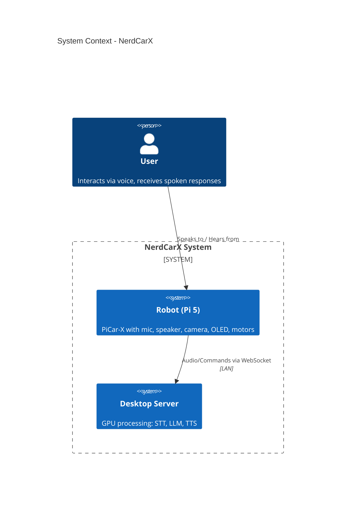
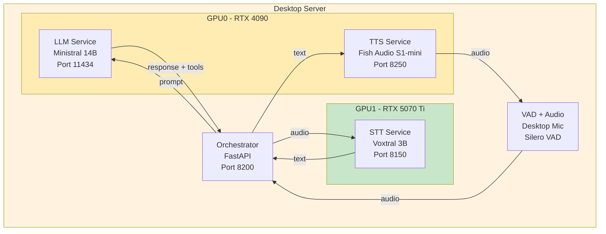
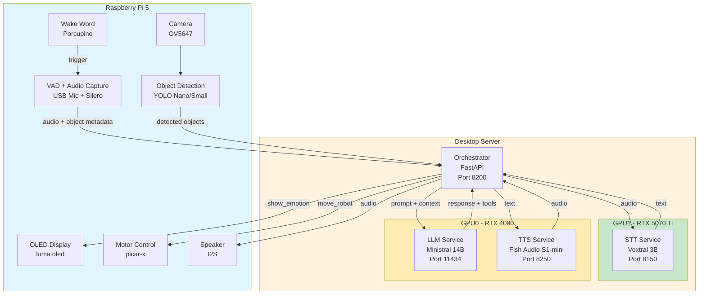
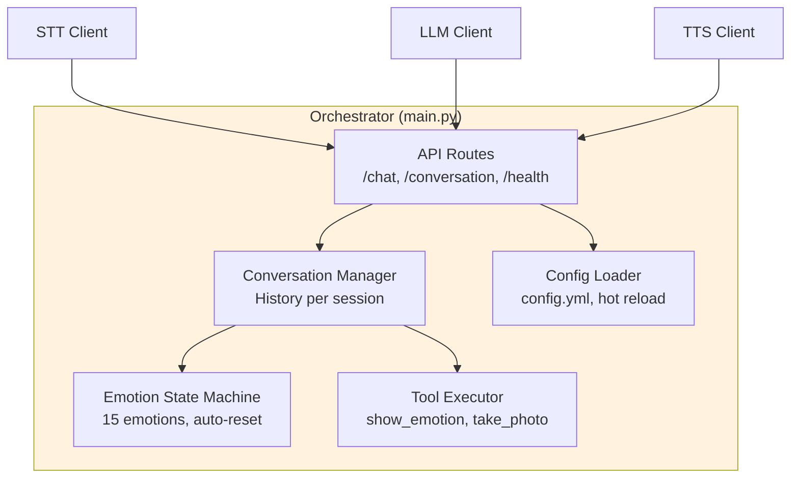
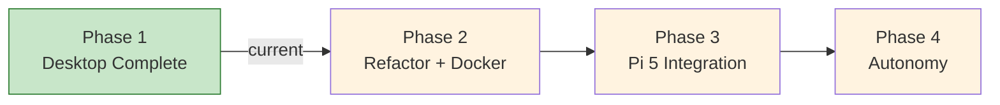

# NerdCarX - Architecture Overview

> **Last updated:** 2026-01-13
> **Current Phase:** 1 (Desktop Complete)

---

## 1. Executive Summary

NerdCarX is an AI-powered robot car that can hold conversations in Dutch, display emotions, and perceive its surroundings through a camera. It's built on a PiCar-X platform with a Raspberry Pi 5, but all heavy AI processing happens on a separate desktop server with GPUs.

**Why local-first?** Everything runs locally - no cloud APIs, no subscription costs, no privacy concerns, no rate limits. The modular architecture means any component (speech recognition, language model, text-to-speech) can be swapped without rewriting the system.

**Current capability:** The desktop demo is fully functional. You can have hands-free conversations in Dutch, the system recognizes emotional context and responds appropriately, and it can describe what it "sees" through a camera. Next: connecting the actual robot hardware.

---

## 2. Design Rationale

### Why Local-First?

| Benefit | Explanation |
|---------|-------------|
| **No recurring costs** | Cloud APIs charge per request. Local = one-time hardware investment |
| **No rate limits** | Experiment freely without API throttling |
| **Privacy** | Conversations never leave your network |
| **Low latency** | No round-trip to cloud servers |
| **Learning opportunity** | Understanding the full stack, not just API calls |
| **Full control** | Tune parameters, switch models, modify behavior |

Cloud fallback is planned (Phase 4+) for flexibility, but local-first remains the default.

### Why Desktop + Pi Split?

The AI models are too heavy for a Raspberry Pi:

| Model | VRAM Required | Pi 5 Has | Verdict |
|-------|---------------|----------|---------|
| Voxtral 3B (STT) | ~15 GB | 0 GB (shared RAM) | Too heavy |
| Ministral 14B (LLM) | ~20 GB | 0 GB | Way too heavy |
| Fish Audio (TTS) | ~4-6 GB | 0 GB | Too heavy |

**Solution:** Desktop does the "thinking" (GPU-heavy AI), Pi does the "sensing and acting" (mic, speaker, motors, display). They communicate over LAN via WebSocket.

### Why These Technologies?

| Choice | Why | Alternatives Considered |
|--------|-----|-------------------------|
| **Ollama** (LLM serving) | Simple setup, one command to run models, built-in API, great for local development | llama.cpp (lower level), vLLM (overkill for single model) |
| **vLLM** (STT serving) | Required for Voxtral - it's a Mistral model needing proper vLLM support, handles batching efficiently | Ollama (doesn't support Voxtral), TGI (less mature) |
| **FastAPI** (Orchestrator) | Lightweight, async, full control, no magic. LangChain considered but adds complexity without clear benefit for this use case | LangChain (too abstract), Flask (not async) |
| **Docker** | Reproducible environments, GPU isolation, easy to deploy and version | Conda only (works but less portable) |
| **WebSocket** (Pi ↔ Desktop) | Bidirectional, low latency, persistent connection for real-time interaction | REST (higher latency, polling needed), MQTT (overkill for point-to-point) |

### Why These Models?

| Model | Why This One | Key Deciding Factors |
|-------|--------------|---------------------|
| **Voxtral Mini 3B** | Dutch is one of only 8 officially supported languages. Better noise robustness than Whisper. Can do audio Q&A, not just transcription. | Tested Faster-Whisper - less robust in noisy environments |
| **Ministral 14B** | Native function calling support, vision capability, reasonable size for 24GB GPU. Official Mistral parameters (temp=0.15) reduce hallucinations. | Tested 8B variant - 14B Q8 noticeably better quality |
| **Fish Audio S1-mini** | #1 on TTS-Arena2 benchmark, ~1.2s latency (vs 5-20s for Chatterbox). Dutch via voice cloning with reference audio. | Tested Chatterbox (too slow), Piper (less expressive), VibeVoice (Belgian accent) |
| **YOLO Nano/Small** | Runs on Pi 5's GPU, real-time object detection, well-documented, many pre-trained variants | Full YOLO too heavy for Pi |
| **Porcupine** (Wake word) | Accurate, low CPU, custom wake words, works offline, has hobby license | Snowboy (discontinued), Mycroft Precise (less accurate) |
| **Silero VAD** | Local, no network, reliable voice activity detection, works with Python | WebRTC VAD (less accurate), cloud VAD (defeats local-first) |

> For complete decision history with dates and alternatives: [DECISIONS.md](DECISIONS.md)

---

## 3. What Can It Do?

| Use Case | Description | Status |
|----------|-------------|--------|
| **Voice Conversation** | Ask questions in Dutch, get spoken answers | Working |
| **Emotional Responses** | Robot displays emotions (happy, sad, curious, etc.) based on conversation tone | Working |
| **Visual Awareness** | "What do you see?" - robot describes its surroundings | Working |
| **Movement Commands** | "Drive forward", "turn left" - physical robot control | Phase 3 |
| **Proactive Interaction** | Robot initiates conversation when idle or detects a person | Phase 4 |

**Example interaction:**
```
User: "Hallo, hoe heet je?"
Robot: [shows happy emotion] "Hoi! Ik ben NerdCarX, een robotauto gemaakt door Ralph."

User: "Wat zie je?"
Robot: [takes photo, analyzes] "Ik zie een bureau met een laptop en een koffiemok."

User: "Je bent stom!"
Robot: [shows sad emotion] "Dat doet pijn om te horen..."
```

> For detailed use cases (UC1-UC9), see [archive/0.concept/picar-x-ai-companion-concept.md](archive/0.concept/picar-x-ai-companion-concept.md)

---

## 4. System Context (C1)

This diagram shows NerdCarX in its environment - who uses it and what systems it connects to.

### Target Architecture (Phase 3+)



> **Current state (Phase 1):** No hardware yet. User interacts via desktop microphone/speaker. All components run on desktop for development and testing.

**Why split between Pi and Desktop?**

| Component | On Pi 5 | On Desktop | Reason |
|-----------|---------|------------|--------|
| Microphone/Speaker | Yes | - | Physical location |
| Wake word detection | Yes | - | Must always listen, low power |
| VAD (Voice Activity Detection) | Yes | - | Low latency, local processing |
| Object Detection (YOLO) | Yes | - | Real-time awareness, runs on Pi GPU |
| OLED/Motors | Yes | - | Hardware control |
| Speech-to-Text | - | Yes | Needs GPU (15GB VRAM) |
| Language Model | - | Yes | Needs GPU (20GB VRAM) |
| Text-to-Speech | - | Yes | Needs GPU, quality matters |

---

## 5. Container View (C2)

The architecture evolves across phases. Below are diagrams showing each stage.

### Phase 1: Desktop Complete (Current)

All components on desktop for development and testing without hardware.



### Phase 3: Pi Integration

Hardware arrives. VAD, wake word, and object detection move to Pi. Heavy AI stays on desktop.



### Dual Vision Approach

| Capability | Location | Speed | Detail | Use Case |
|------------|----------|-------|--------|----------|
| **Object Detection (YOLO)** | Pi | Real-time | Objects only | Quick context: "person detected", "obstacle ahead" |
| **LLM Vision (take_photo)** | Desktop | 5-10s | Full scene | Detailed analysis: "What do you see?" |

**How they work together:**
- YOLO runs continuously on Pi, sends metadata with each request (e.g., `"detected": ["person", "cup"]`)
- LLM receives this context automatically, enabling awareness without explicit photo requests
- Enables use cases like: "drive towards the user" (YOLO detects person, motors respond)
- `take_photo` tool still available for detailed scene description when needed

### Service Details

| Service | Technology | Latency | Purpose |
|---------|------------|---------|---------|
| **STT** | Voxtral Mini 3B + vLLM | 150-750ms | Dutch speech recognition, noise robust |
| **LLM** | Ministral 14B Q8 + Ollama | 700-1300ms | Conversation, reasoning, function calling, vision |
| **TTS** | Fish Audio S1-mini | ~1.2s/sentence | Dutch voice synthesis via reference audio |
| **Orchestrator** | FastAPI | - | Routes requests, manages state, executes tools |
| **Object Detection** | YOLO Nano/Small | Real-time | Quick object awareness on Pi |

---

## 6. Component View (C3)

Inside the Orchestrator - the brain that coordinates everything.



### Key Features

**Emotion State Machine:**
- 15 emotions: happy, sad, angry, surprised, neutral, curious, confused, excited, thinking, shy, love, tired, bored, proud, worried
- Persistent per conversation (in-memory)
- Auto-reset to neutral after 5 minutes of inactivity
- Current emotion passed to LLM for context awareness

**Function Calling:**
- `show_emotion(emotion)` - Update robot's emotional display
- `take_photo(question)` - Capture and analyze image
- Supports both native JSON format and text-based fallback parsing

**Configuration:**
- Single `config.yml` for all settings
- Hot-reload via `/reload-config` endpoint
- No restart needed for parameter changes

> Implementation details: [fase1-desktop/orchestrator/main.py](fase1-desktop/orchestrator/main.py)

---

## 7. Technology Stack

| Component | Technology | Why This Choice |
|-----------|------------|-----------------|
| **STT** | Voxtral Mini 3B + vLLM | Dutch support (1 of 8 languages), noise robust, audio Q&A |
| **LLM** | Ministral 14B Q8 + Ollama | Function calling, vision, low temperature for consistency |
| **TTS** | Fish Audio S1-mini | #1 TTS benchmark, 4x faster than alternatives, voice cloning |
| **Orchestrator** | FastAPI | Simple, fast, full control, no framework overhead |
| **Wake Word** | Picovoice Porcupine | Accurate, low CPU, custom wake words |
| **VAD** | Silero VAD | Local, no network, reliable |
| **Containerization** | Docker | Reproducible, isolated, easy deployment |

> Full decision rationale with alternatives considered: [DECISIONS.md](DECISIONS.md)

---

## 8. Current Status

### What's Working (Phase 1)

| Component | Status | Notes |
|-----------|--------|-------|
| Speech-to-Text | Working | Dutch, noise-robust, 150-750ms |
| Language Model | Working | Function calling, vision, 700-1300ms |
| Text-to-Speech | Working | Dutch voice via reference audio, ~1.2s/sentence |
| Emotion State Machine | Working | 15 emotions, persistent state |
| Vision Tool | Working | Photo analysis on demand |
| VAD Conversation | Working | Hands-free interaction |
| Central Config | Working | Hot-reload supported |

### Performance

| Metric | Value |
|--------|-------|
| STT latency | 150-750ms |
| LLM latency | 700-1300ms |
| TTS latency | ~1.2s per sentence |
| Vision latency | 5-10s (dual LLM call) |
| **Total round-trip** | **~3 seconds** |

### Currently Refining

The following items from [fase1-desktop/TODO.md](fase1-desktop/TODO.md) are being addressed:

1. **TTS text normalization** - Acronyms and numbers sometimes sound English (e.g., "API" → "aa-pee-ie")
2. **TTS parameter tuning** - Finding optimal temperature/top_p balance
3. **Optional improvements** - Longer reference audio, pseudo-streaming per sentence

---

## 9. Roadmap



### Phase 1: Desktop Complete (Current)
All AI components working end-to-end on desktop. Hands-free Dutch conversations with emotion awareness and vision capability.

**Details:** [fase1-desktop/README.md](fase1-desktop/README.md)

### Phase 2: Refactor + Docker
Clean up code (SOLID, KISS, DRY), full Docker Compose stack, API documentation, testing. Goal: `docker compose up` starts everything.

**Details:** [fase2-refactor/PLAN.md](fase2-refactor/PLAN.md)

### Phase 3: Pi 5 Integration
Connect real hardware - PiCar-X robot, OLED display, motors, wake word detection. Desktop remains the AI brain, Pi handles physical interaction.

**Details:** [fase3-pi/PLAN.md](fase3-pi/PLAN.md)

### Phase 4: Autonomy & Personality
Add "life" to the robot - idle behaviors (blinking, looking around), proactive conversations, long-term memory, obstacle avoidance, consistent personality.

**Details:** [fase4-autonomie/PLAN.md](fase4-autonomie/PLAN.md)

---

## 10. Future Possibilities

The modular architecture creates a **foundation** that can grow without rewrites. Here's what the system can support:

### Hardware Extensions

| Extension | What It Enables |
|-----------|-----------------|
| Additional sensors (temp, light, distance) | Environmental awareness, context-aware responses |
| Multiple cameras | Wider field of view, depth perception |
| Different display (LCD, LED matrix) | Richer visual feedback |
| Additional actuators (arm, gripper) | Physical interaction capabilities |
| Lidar/depth sensor | Better navigation, 3D awareness |

### AI Model Flexibility (Local ↔ Cloud)

The architecture is designed (Phase 2 refactor) to easily swap between local and cloud providers. Implementation planned for Phase 4+.

| Component | Local (Default) | Cloud Options |
|-----------|-----------------|---------------|
| **STT** | Voxtral Mini 3B | Whisper via DeepInfra, AssemblyAI, cloud providers |
| **LLM** | Ministral 14B (Ollama) | OpenRouter, OpenAI, Claude, KiloCode, Ollama Cloud |
| **TTS** | Fish Audio S1-mini | ElevenLabs (likely primary), other cloud TTS |
| **Vision** | LLM vision + YOLO | Cloud vision APIs if needed |

**Why cloud fallback?**
- Higher quality models when needed (e.g., Claude for complex reasoning)
- Reduced local GPU requirements for lighter deployments
- Fallback when local resources are insufficient
- A/B testing different providers

**Implementation approach:**
- Phase 2: Design service interfaces with SOLID principles (easy to swap implementations)
- Phase 4+: Implement cloud adapters, add configuration switches

### Interface Extensions

- **Web dashboard** - Remote monitoring, configuration, conversation history
- **Mobile app** - Control robot from phone, receive notifications
- **REST/WebSocket API** - Third-party integrations, custom clients
- **Home automation** - Home Assistant, possibly MQTT if needed for smart home integration
- **Voice assistant bridge** - Connect to Alexa/Google Home ecosystem

### Behavior Extensions

- **Custom tools** - Check weather, control smart home, play music, set timers
- **Learning/memory** - Remember preferences, past conversations, user profiles
- **Multi-robot coordination** - Multiple robots sharing one brain
- **Scheduled tasks** - Routines, reminders, time-based behaviors
- **Emotional learning** - Adapt personality based on interactions

### Deployment Flexibility

- **Fully portable** - Battery powered with 4G/WiFi connectivity
- **Multi-robot setup** - Multiple Pi robots sharing one desktop server
- **Edge deployment** - Run smaller models directly on Pi for offline use
- **Hybrid processing** - Split workloads between Pi, desktop, and cloud based on requirements

---

## Quick Reference

| Resource | Location |
|----------|----------|
| Main README | [README.md](README.md) |
| All decisions with rationale | [DECISIONS.md](DECISIONS.md) |
| Phase 1 details | [fase1-desktop/README.md](fase1-desktop/README.md) |
| Open improvements | [fase1-desktop/TODO.md](fase1-desktop/TODO.md) |
| Original concept (detailed) | [archive/0.concept/](archive/0.concept/) |
| Central configuration | [fase1-desktop/config.yml](fase1-desktop/config.yml) |

---

## Hardware Requirements

**Desktop Server (AI Processing):**
| Component | Minimum | Recommended |
|-----------|---------|-------------|
| GPU | RTX 3080 (10GB) | RTX 4090 (24GB) + RTX 5070 Ti |
| RAM | 32GB | 64GB |
| OS | Linux (Ubuntu 22.04+) | Linux |

**Robot (Pi 5 Client):**
| Component | Specification |
|-----------|---------------|
| Raspberry Pi 5 | 8GB RAM (16GB recommended) |
| PiCar-X Kit | v2.0 |
| OLED Display | 0.96" I2C (128x64) |
| USB Microphone | Omnidirectional |
| Camera | OV5647 via CSI |

---

*NerdCarX - A learning project for AI-driven robotics*
