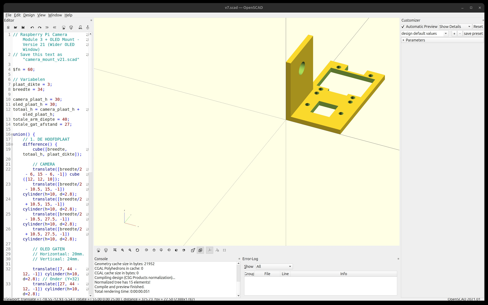

# Custom 3D Printed Parts

Aangepaste 3D-geprinte onderdelen voor NerdCarX.

## Waarom custom parts?

De standaard PiCar-X camera mount is ontworpen voor de **Camera Module 2**. De nieuwe **Camera Module 3** heeft een grotere lens die niet past. Daarnaast wilden we een **OLED display** toevoegen voor emoties, wat niet voorzien is in het originele ontwerp.

Oplossing: zelf een aangepaste mount ontwerpen en 3D-printen.

## AI-Assisted CAD Workflow

Dit bleek een uitstekende manier om snel prototypes te maken:

### Stap 1: Beschrijf wat je nodig hebt aan een AI

Gebruik een AI assistent (Claude, Gemini, ChatGPT, etc.) en beschrijf:

1. **Wat het onderdeel moet doen** (functie)
2. **Hoe het eruit moet zien** (vorm)
3. **Exacte afmetingen** van componenten die erop moeten passen

**Voorbeeld prompt:**

> Ik heb een mount nodig voor een Raspberry Pi Camera Module 3 en een 0.96" OLED display (SSD1306).
> De mount moet bevestigd worden op een servo met een 8mm as-gat op 27mm van de rand.
>
> Camera Module 3 specs:
> - Board: 25mm x 24mm
> - Mounting holes: 21mm x 12.5mm spacing, M2 schroefdraad
> - Lens diameter: ~12mm (moet vrij blijven)
>
> OLED specs:
> - Board: 27mm x 27mm
> - Display area: 26.7mm x 19.3mm
> - Mounting holes: 20mm x 24mm spacing
>
> Maak OpenSCAD code voor dit onderdeel.

### Stap 2: Genereer OpenSCAD code

Vraag om **OpenSCAD code** (.scad) - dit is parametrische CAD in code vorm. Voordelen:

- Makkelijk aan te passen (verander een getal, druk F5)
- Versiebeheer in Git
- AI kan code genereren en debuggen
- Gratis en open source

### Stap 3: Itereer in OpenSCAD

1. Download [OpenSCAD](https://openscad.org/) (gratis, Windows/Mac/Linux)
2. Open het .scad bestand
3. **F5** = Preview (snel, voor itereren)
4. Pas waardes aan, F5, herhaal
5. **F6** = Render (langzamer, voor export)
6. **File → Export → STL** voor 3D print

### Stap 4: 3D Print

1. Open STL in je slicer (Cura, PrusaSlicer, etc.)
2. Slice met geschikte settings (0.2mm layer, 20% infill is meestal fine)
3. Print
4. Test fit, noteer aanpassingen
5. Terug naar stap 3 indien nodig

## Onderdelen in deze map

### v7.scad / v7.stl - Camera + OLED Mount

Aangepaste mount die op de tilt servo van de PiCar-X past:



```
    ┌─────────────────────┐
    │   OLED Display      │  ← 0.96" SSD1306
    │   ┌───────────┐     │
    │   │  Window   │     │
    │   └───────────┘     │
    ├─────────────────────┤
    │   Camera Module 3   │  ← IMX708
    │      ○ lens ○       │
    │                     │
    └───┬─────────────────┘
        │
        └── Zij-arm met 8mm gat voor servo as
```

**Features:**
- Camera lens opening (12mm)
- 4x M2 mounting holes voor camera
- 4x M2 mounting holes voor OLED
- Window cutout voor OLED display (27.7 x 19.3mm)
- Kabel relief voor flex cable
- Zij-arm met 8mm gat voor tilt servo bevestiging

## Tips

- **Meet twee keer, print één keer** - Check alle afmetingen met een schuifmaat
- **Tolerance** - Voeg 0.2-0.5mm toe aan gaten voor goede fit
- **Iteratie is normaal** - v7 betekent 7 iteraties, dat is prima
- **AI kan debuggen** - Stuur een foto van wat niet past, AI kan helpen fixen

## Software

- **OpenSCAD**: https://openscad.org/ (gratis, open source)
- **Slicer opties**: Cura, PrusaSlicer, OrcaSlicer (allemaal gratis)
